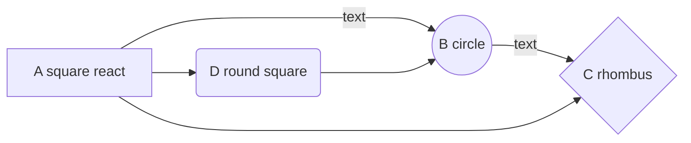
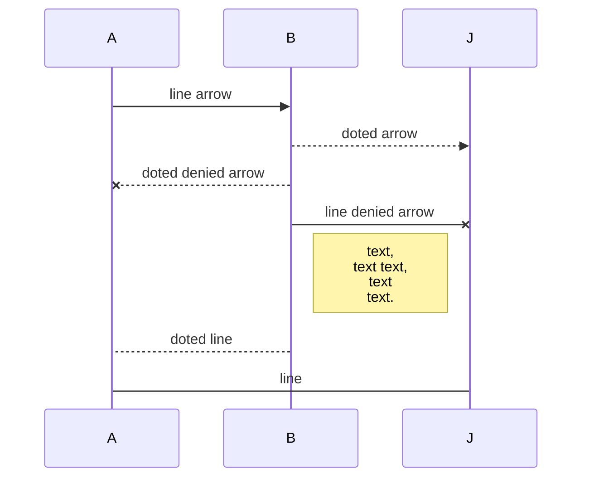

# Letter game

This is a little project i started for **my 4 year old**. [Letter game](https://vygintask.github.io/letter-game/) should boost learning of specific letters.

## Project goals:
- create interactive **tool** to boost learning interest of **my child**;
- explore new ways of writing using **GDP** assistance;
- remember how to uses **SCSS**;
- learn how to use **sound**;
- learn how to use **MD**;
- adapt resolution **for specific devices** she uses both vertical and horizontal.

## Learning MD:
### Flow:

### Tablet:
|                |ASCII                          |HTML                         |
|----------------|-------------------------------|-----------------------------|
|Single backticks|`'tablet'`                     |'tablet'                     |
|Quotes          |`"text"`                       |"text"                       |
|Dashes          |`-- is en-dash, --- is em-dash`|-- is en-dash, --- is em-dash|

## Diagrams:
